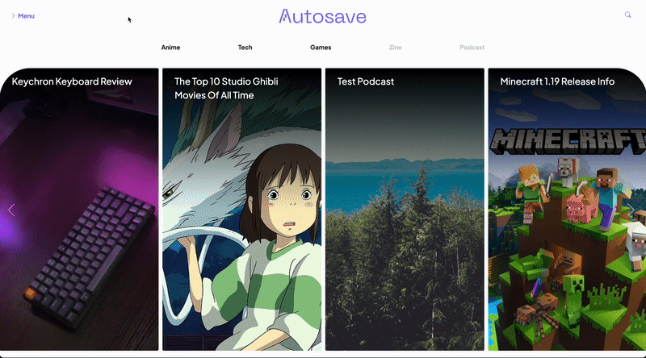
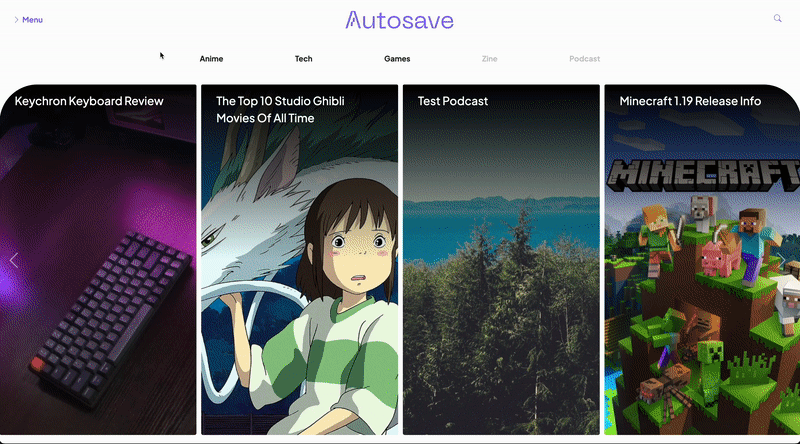

# Autosave Wordpress Theme
Autosave is a media company dedicated to posting about anime, tech, and games. This repository contains the WordPress theme that powers the website where said posts are made.

WEBSITE LINK COMING SOON!


## File Directory
```
├── .vscode
├── assets
│   ├── css
│   ├── fonts
│   ├── js
│   ├── scss
├── functions
├── template-parts
├── style.css
├── **/*.php (page template files)
├── README.md
├── LICENSE
├── screenshot.png
└── .gitignore
```
\*Purpose of each file is written at the top comment of the file

## Features of Note
<div style="float: left; width: 48%; margin-right: 2%;">
    <p>Responsive mobile compatibility</p>
    
</div>
<div style="float: left; width: 50%;">
    <p>Smooth expanding header navbar</p>
    
    <p>two-layer collapsing hedaer</p>
    
    <p>Support light and dark themes</p>
    
    <p>Advanced auto-tiling of post cards</p>
    
</div>


## Dependencies
* Bootstrap
* Bootstrap Icons
* Jquery
* Slick JS
* Plus Jakarta Sans (Font)

## Required Wordpress Plugins
* Advanced Custom Fields
* Crop Thumbnails
* Require Featured Image
* Require Post Category

## To-Do
- [ ] Finish podcasts page
- [ ] Finish zine functionality
- [ ] Create templates for About Us and Terms of Service pages
- [ ] Add support for ads